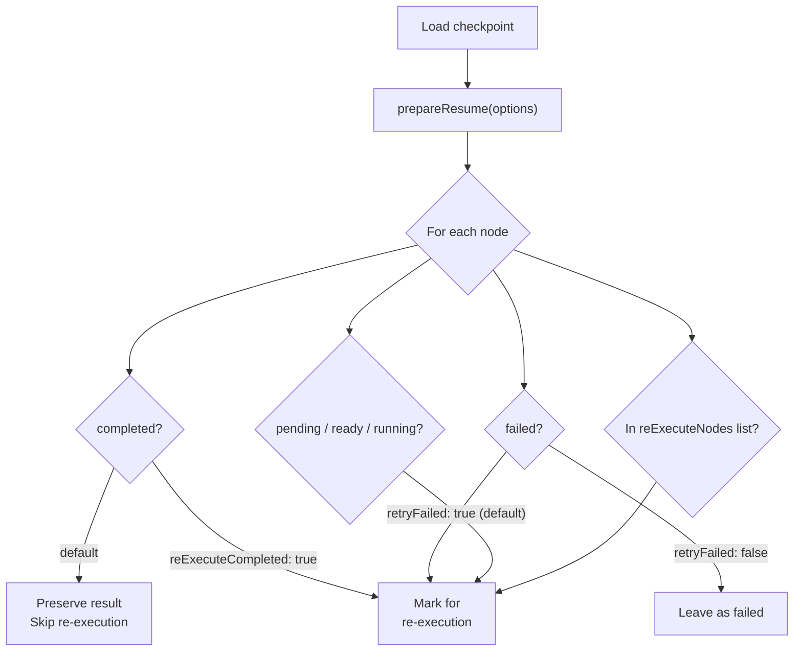

# Diagram 4: flowchart

```mermaid
flowchart TD
    LOAD["Load checkpoint"] --> PREPARE["prepareResume(options)"]
    PREPARE --> EACH{"For each node"}

    EACH --> COMPLETED{"completed?"}
    COMPLETED -->|"default"| PRESERVE["Preserve result\nSkip re-execution"]
    COMPLETED -->|"reExecuteCompleted: true"| REEXEC["Mark for\nre-execution"]

    EACH --> FAILED{"failed?"}
    FAILED -->|"retryFailed: true (default)"| REEXEC
    FAILED -->|"retryFailed: false"| SKIP["Leave as failed"]

    EACH --> PENDING{"pending / ready / running?"}
    PENDING --> REEXEC

    EACH --> SPECIFIC{"In reExecuteNodes list?"}
    SPECIFIC --> REEXEC
```
