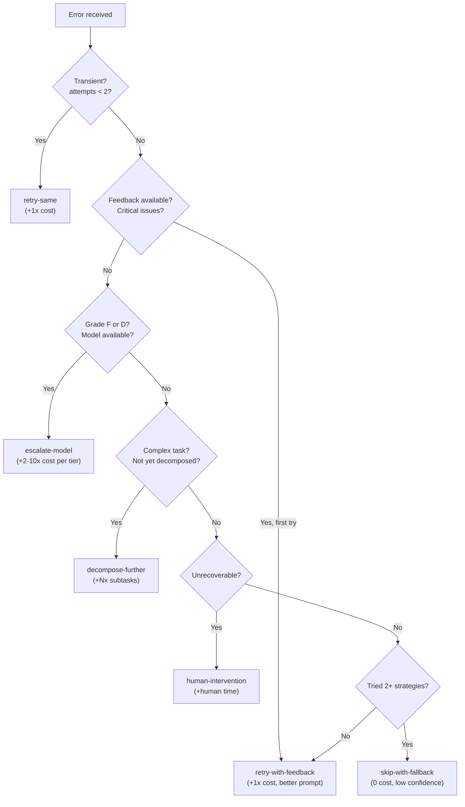

# Diagram 5: flowchart

```mermaid
flowchart TD
    ERR["Error received"] --> TRANS{"Transient?\nattempts < 2?"}
    TRANS -->|Yes| RS["retry-same\n(+1x cost)"]
    TRANS -->|No| FEED{"Feedback available?\nCritical issues?"}
    FEED -->|"Yes, first try"| RWF["retry-with-feedback\n(+1x cost, better prompt)"]
    FEED -->|No| GRADE{"Grade F or D?\nModel available?"}
    GRADE -->|Yes| EM["escalate-model\n(+2-10x cost per tier)"]
    GRADE -->|No| COMPLEX{"Complex task?\nNot yet decomposed?"}
    COMPLEX -->|Yes| DF["decompose-further\n(+Nx subtasks)"]
    COMPLEX -->|No| UNREC{"Unrecoverable?"}
    UNREC -->|Yes| HI["human-intervention\n(+human time)"]
    UNREC -->|No| TRIED{"Tried 2+ strategies?"}
    TRIED -->|Yes| SWF["skip-with-fallback\n(0 cost, low confidence)"]
    TRIED -->|No| RWF
```
