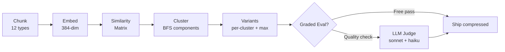
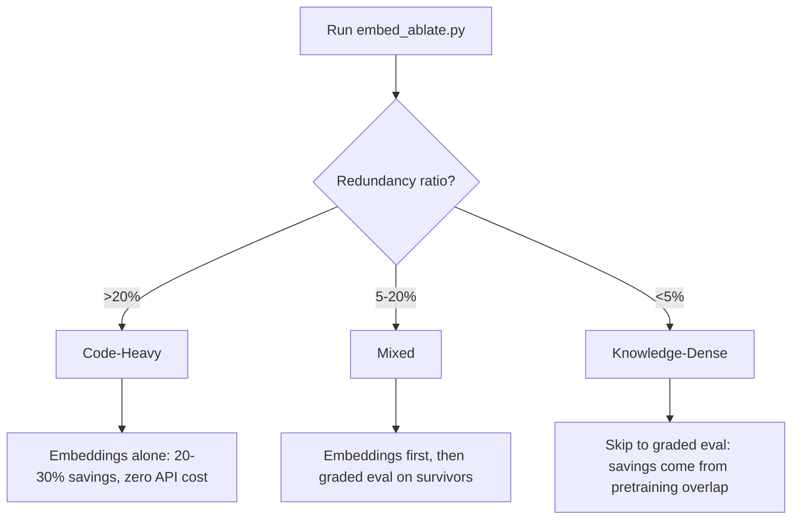

# /windagszip — Skill Compression via Embeddings

Analyze SKILL.md files for redundancy and produce compressed variants that preserve behavioral quality while cutting token count.

**Two types of redundancy exist in skills:**
1. **Intra-skill duplication** — chunk A says the same thing as chunk B within the same skill. Detected by embedding cosine similarity. Cost: zero.
2. **Pretraining overlap** — chunk teaches what Claude already knows from training data. Detected by LLM-judged quality eval. Cost: ~$0.011/test case.

Always run embeddings first (free), then graded eval on survivors (targeted).

---

## When to Activate

- Compressing a SKILL.md to reduce context window consumption
- Analyzing redundancy patterns in one or many skills
- Generating ablation variants for quality testing
- Identifying which chunks carry unique signal vs. duplicate other chunks
- Pre-filtering before expensive graded eval

---

## Compression Pipeline



### Step 1: Analyze Redundancy

All scripts live in `tools/skill-compression/` relative to the WinDAGs repo root.

```bash
python tools/skill-compression/embed_ablate.py <skill-name>
```

Output shows redundancy clusters — groups of chunks saying the same thing:

```
Cluster 1 (avg sim: 0.847, redundant tokens: 2,127)
  KEEP [reference   ] 1821tk  Full CSS layering reference...
  CUT  [code_block  ]  312tk  .aurora-container { position: absol...
  CUT  [code_block  ]  287tk  .atmosphere-layer { position: absol...
```

**KEEP** = canonical version (most complete). **CUT** = duplicates the canonical.

### Step 2: Generate Compressed Variants

```bash
python tools/skill-compression/embed_ablate.py <skill-name> --generate
```

Produces per-cluster variants (remove one cluster's redundancy) and a max-compression variant (remove all redundancy). Output in `ablations/<skill-name>/`.

### Step 3: Validate Quality (Optional)

If a test suite exists for the skill:

```bash
# Verify pipeline with 1 test case
python tools/skill-compression/eval_judge.py <skill-name> --test

# Run baseline + top 5 variants by token removal
python tools/skill-compression/eval_judge.py <skill-name> --top-n 5

# Full evaluation (all variants)
python tools/skill-compression/eval_judge.py <skill-name> --all

# Analyze saved results (no API calls)
python tools/skill-compression/eval_judge.py <skill-name> --analyze
```

Two-phase LLM judge: sonnet executor generates a response using the ablated skill, haiku grader scores against expected behavior. Score drop < 0.05 = safe to compress.

---

## Two Compression Regimes

Skills fall into two categories. The regime determines the compression strategy:



### Code-Heavy (>20% intra-skill redundancy)
- **Pattern**: Many code blocks showing variations of the same technique
- **Examples**: web-weather-creator (25.2%), modern-auth-2026 (24.4%)
- **Strategy**: Embeddings alone achieve 20-30% compression. No API calls needed.
- **Why**: 11 CSS blocks all doing `position: absolute; inset: 0` get subsumed by one reference.

### Knowledge-Dense (<5% intra-skill redundancy)
- **Pattern**: Each chunk is unique within the skill but overlaps with Claude's training data
- **Examples**: metal-shader-expert (2.4%), code-review-checklist (0.0%)
- **Strategy**: Skip to graded eval. Compression comes from pretraining overlap.
- **Why**: Claude already knows PBR shading — the reference file confirms rather than teaches.

---

## Interpreting Results

### Redundancy Ratio Guide

| Range | Meaning | Action |
|-------|---------|--------|
| >20% | Heavy self-duplication | Compress with embeddings only |
| 5-20% | Moderate duplication | Embeddings first, then graded eval |
| <5% | Minimal self-duplication | Skip to graded eval |
| 0% | No intra-skill redundancy | All savings come from pretraining overlap |

### Quality Thresholds

| Score Drop | Interpretation | Decision |
|------------|---------------|----------|
| < 0.05 | Within measurement noise | Safe to compress |
| 0.05-0.10 | Borderline | Run more test cases |
| > 0.10 | Real quality loss | Keep the chunk |
| Negative (improvement) | Chunk was actively hurting quality | Definitely remove |

---

## Anti-Patterns

- Do not edit or rewrite skill content -- delegate to skill-creator instead.
- Do not create new skills from scratch -- delegate to skill-architect instead.
- Do not attempt routing optimization, trigger-rate tuning, or cross-skill deduplication -- separate concerns requiring different tools.
- Do not lower the similarity threshold below 0.60 -- false positive rate rises sharply.

### Anti-Pattern: More Detail Always Helps
Removing detailed content about well-known topics can IMPROVE quality. Claude's broader knowledge outperforms a skill's narrow checklist items. When a skill micromanages topics Claude already mastered, the extra tokens compete with Claude's training data and produce worse responses. Less is more for pretraining-overlapping content. **Detection**: Run graded eval. If score improves when a chunk is removed (negative quality drop), that chunk was actively hurting performance.

### Anti-Pattern: Compress Before Measuring
Human intuition about which chunks are redundant is unreliable. Chunks that look unique may embed nearly identically (same semantic signal), while chunks that look similar may encode distinct signals. Always run embeddings first to get the objective similarity matrix, then validate with graded eval. **Detection**: Compare human-proposed cuts against embedding clusters. Mismatches reveal hidden redundancy or false duplicates.

---

## Chunk Taxonomy

The chunker identifies 12 semantic types. Ablatable types (COMPOUND, PARAGRAPH, LIST_BLOCK, CODE_BLOCK, MERMAID, REFERENCE) are candidates for removal. Structural types (SECTION, SUBSECTION) and routing metadata (YAML_PAIRS_WITH) are never removed. A paragraph ending with `:` or containing "here's"/"for example" bonds to the next code block into a COMPOUND unit -- ablated together, never separately.

For the full taxonomy table, read `./references/technical-details.md`.

---

## Threshold Tuning

Default cosine similarity threshold: **0.70**.

```bash
# Aggressive (more duplicates caught, risk of false positives)
python tools/skill-compression/embed_ablate.py <skill-name> --threshold 0.60

# Conservative (only obvious duplicates)
python tools/skill-compression/embed_ablate.py <skill-name> --threshold 0.80
```

For production compression, use 0.70 and validate with graded eval.

---

## Technical Reference

For worked examples, embedding model internals, similarity computation details, clustering algorithm, dependency installation, script inventory, and rate-distortion theory background, read `./references/technical-details.md`.

Key dependencies (for quick setup):

```bash
pip install sentence-transformers numpy
```

All scripts live in `tools/skill-compression/` from the repo root. Primary entry points: `embed_ablate.py` (redundancy analysis) and `eval_judge.py` (LLM-judged quality eval).

---

## Output Contract

This skill produces:

- **Redundancy analysis report** -- cluster counts, redundant token totals, per-cluster KEEP/CUT breakdown printed to stdout
- **Compressed SKILL.md variants** -- one per cluster (single-cluster removal) plus one max-compression variant, written to `ablations/<skill-name>/`
- **Variants manifest** -- `ablations/<skill-name>/variants.jsonl` with metadata per variant (chunks removed, token delta, variant ID)
- **Quality evaluation results** (when graded eval is run) -- per-variant scores, score deltas, and R(D) curve data written to `eval-results/<skill-name>/`
