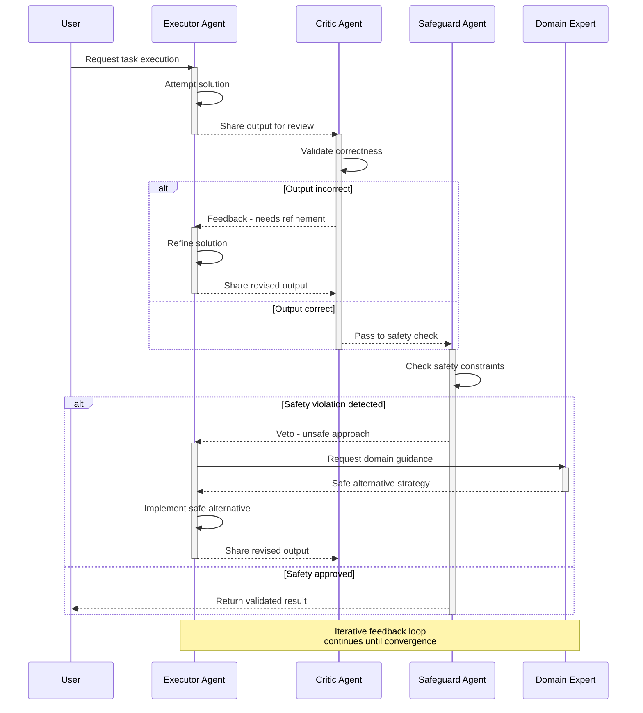

# Multi-Agent Conversation Flow Patterns

```mermaid
sequenceDiagram
    participant User
    participant Executor as Executor Agent
    participant Critic as Critic Agent
    participant Safeguard as Safeguard Agent
    participant Expert as Domain Expert

    User->>Executor: Request task execution
    activate Executor
    
    Executor->>Executor: Attempt solution
    Executor-->>Critic: Share output for review
    deactivate Executor
    
    activate Critic
    Critic->>Critic: Validate correctness
    alt Output incorrect
        Critic-->>Executor: Feedback - needs refinement
        activate Executor
        Executor->>Executor: Refine solution
        Executor-->>Critic: Share revised output
        deactivate Executor
    else Output correct
        Critic-->>Safeguard: Pass to safety check
    end
    deactivate Critic
    
    activate Safeguard
    Safeguard->>Safeguard: Check safety constraints
    alt Safety violation detected
        Safeguard-->>Executor: Veto - unsafe approach
        activate Executor
        Executor->>Expert: Request domain guidance
        activate Expert
        Expert-->>Executor: Safe alternative strategy
        deactivate Expert
        Executor->>Executor: Implement safe alternative
        Executor-->>Critic: Share revised output
        deactivate Executor
    else Safety approved
        Safeguard-->>User: Return validated result
    end
    deactivate Safeguard

    Note over Executor,Expert: Iterative feedback loop<br/>continues until convergence
```
