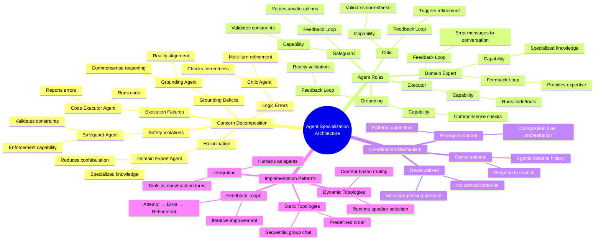

# Agent Specialization Architecture & Concern Decomposition

```mermaid
mindmap
  root((Agent Specialization<br/>Architecture))
    Concern Decomposition
      Hallucination
        Domain Expert Agent
          Specialized knowledge
          Reduces confabulation
      Safety Violations
        Safeguard Agent
          Validates constraints
          Enforcement capability
      Logic Errors
        Critic Agent
          Checks correctness
          Multi-turn refinement
      Execution Failures
        Code Executor Agent
          Runs code
          Reports errors
      Grounding Deficits
        Grounding Agent
          Commonsense reasoning
          Reality alignment
    Agent Roles
      Executor
        Capability
          Runs code/tools
        Feedback Loop
          Error messages to conversation
      Safeguard
        Capability
          Validates constraints
        Feedback Loop
          Vetoes unsafe actions
      Critic
        Capability
          Validates correctness
        Feedback Loop
          Triggers refinement
      Domain Expert
        Capability
          Specialized knowledge
        Feedback Loop
          Provides expertise
      Grounding
        Capability
          Commonsense checks
        Feedback Loop
          Reality validation
    Coordination Mechanism
      Decentralized
        No central controller
        Message-passing protocol
      Conversational
        Agents observe history
        Respond to context
      Emergent Control
        Patterns guide flow
        Composition over orchestration
    Implementation Patterns
      Static Topologies
        Sequential group chat
        Predefined order
      Dynamic Topologies
        Runtime speaker selection
        Content-based routing
      Feedback Loops
        Attempt → Error → Refinement
        Iterative improvement
      Integration
        Tools as conversation turns
        Humans as agents
```
