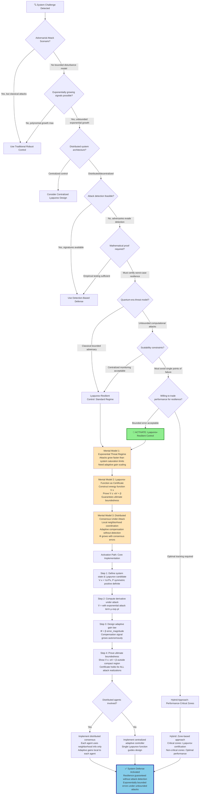

# Symptom-Based Defense Decision Tree

```mermaid
flowchart TD
    A["🔍 System Challenge Detected"] --> B{Adversarial Attack Scenario?}
    
    B -->|No bounded disturbance model| C{Exponentially growing signals possible?}
    B -->|Yes, but classical attacks| D["Use Traditional Robust Control"]
    
    C -->|No, polynomial growth max| D
    C -->|Yes, unbounded exponential growth| E{Distributed system architecture?}
    
    E -->|Centralized control| F["Consider Centralized Lyapunov Design"]
    E -->|Distributed/decentralized| G{Attack detection feasible?}
    
    G -->|Yes, signatures available| H["Use Detection-Based Defense"]
    G -->|No, adversaries evade detection| I{Mathematical proof required?}
    
    I -->|Empirical testing sufficient| H
    I -->|Must certify worst-case resilience| J{Quantum-era threat model?}
    
    J -->|Classical bounded adversary| K["Lyapunov-Resilient Control: Standard Regime"]
    J -->|Unbounded computational attacks| L{Scalability constraints?}
    
    L -->|Centralized monitoring acceptable| K
    L -->|Must avoid single points of failure| M{Willing to trade performance for resilience?}
    
    M -->|Optimal tracking required| N["Hybrid Approach: Performance-Critical Zones"]
    M -->|Bounded error acceptable| O["🎯 ACTIVATE: Lyapunov-Resilient Control"]
    
    K --> P["Mental Model 1: Exponential Threat Regime<br/>Attacks grow faster than system saturation limits<br/>Need adaptive gain scaling"]
    O --> P
    
    P --> Q["Mental Model 2: Lyapunov Function as Certificate<br/>Construct energy function V·x<br/>Prove V̇ ≤ -αV + β<br/>Guarantees ultimate boundedness"]
    
    Q --> R["Mental Model 3: Distributed Consensus Under Attack<br/>Local neighborhood coordination<br/>Adaptive compensation without detection<br/>Φ grows with consensus errors"]
    
    R --> S["Activation Path: Core Implementation"]
    
    S --> T["Step 1: Define system state & Lyapunov candidate<br/>V·x = ½x'Px, P symmetric positive definite"]
    T --> U["Step 2: Compute derivative under attack<br/>V̇ = with exponential attack term µ·exp·ρt"]
    U --> V["Step 3: Design adaptive gain law<br/>Φ̇ = β·error_magnitude<br/>Compensation signal grows autonomously"]
    V --> W["Step 4: Prove ultimate boundedness<br/>Show V̇ ≤ -αV + β outside compact region<br/>Certificate holds for ALL attack realizations"]
    
    W --> X{Distributed agents involved?}
    X -->|Yes| Y["Implement distributed consensus<br/>Each agent uses neighborhood info only<br/>Adaptive gains local to each agent"]
    X -->|No| Z["Implement centralized adaptive controller<br/>Single Lyapunov function guides design"]
    
    Y --> AA["✅ System Defense Activated<br/>Resilience guaranteed without attack detection<br/>Exponentially bounded errors under unbounded attacks"]
    Z --> AA
    
    N --> AB["Hybrid: Zone-based approach<br/>Critical zones: Lyapunov certification<br/>Non-critical zones: Optimal performance"]
    AB --> AA
    
    style O fill:#90EE90,stroke:#228B22,stroke-width:3px
    style AA fill:#87CEEB,stroke:#00008B,stroke-width:3px
    style P fill:#FFE4B5
    style Q fill:#FFE4B5
    style R fill:#FFE4B5
```
