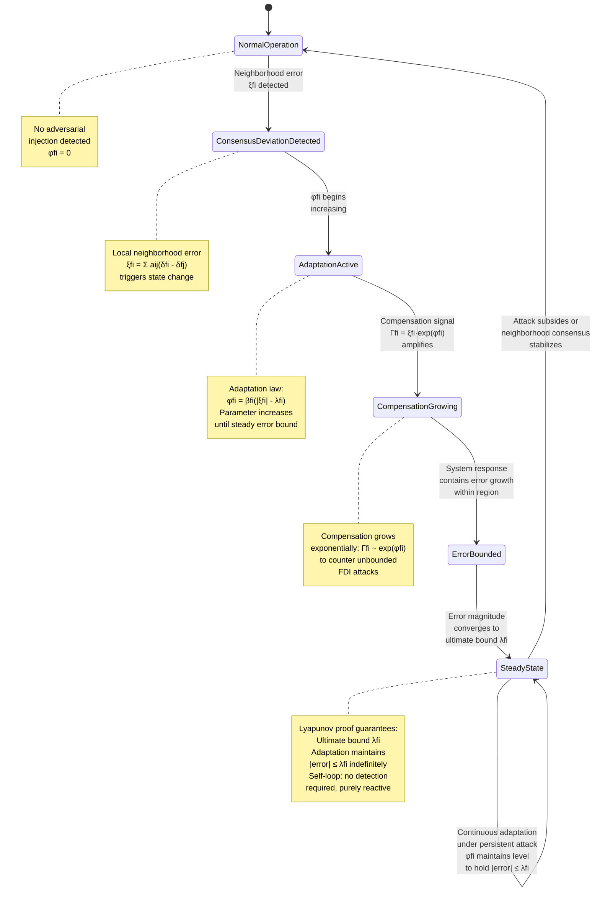

# Distributed Agent State Machine Under Attack

```mermaid
stateDiagram-v2
    [*] --> NormalOperation
    
    NormalOperation --> ConsensusDeviationDetected: Neighborhood error<br/>ξfi detected
    
    ConsensusDeviationDetected --> AdaptationActive: φfi begins<br/>increasing
    
    AdaptationActive --> CompensationGrowing: Compensation signal<br/>Γfi = ξfi·exp(φfi)<br/>amplifies
    
    CompensationGrowing --> ErrorBounded: System response<br/>contains error growth<br/>within region
    
    ErrorBounded --> SteadyState: Error magnitude<br/>converges to<br/>ultimate bound λfi
    
    SteadyState --> SteadyState: Continuous adaptation<br/>under persistent attack<br/>φfi maintains level<br/>to hold |error| ≤ λfi
    
    SteadyState --> NormalOperation: Attack subsides or<br/>neighborhood consensus<br/>stabilizes
    
    note right of NormalOperation
        No adversarial
        injection detected
        φfi = 0
    end note
    
    note right of ConsensusDeviationDetected
        Local neighborhood error
        ξfi = Σ aij(δfi - δfj)
        triggers state change
    end note
    
    note right of AdaptationActive
        Adaptation law:
        φ̇fi = βfi(|ξfi| - λfi)
        Parameter increases
        until steady error bound
    end note
    
    note right of CompensationGrowing
        Compensation grows
        exponentially: Γfi ~ exp(φfi)
        to counter unbounded
        FDI attacks
    end note
    
    note right of SteadyState
        Lyapunov proof guarantees:
        Ultimate bound λfi
        Adaptation maintains
        |error| ≤ λfi indefinitely
        Self-loop: no detection
        required, purely reactive
    end note
```
