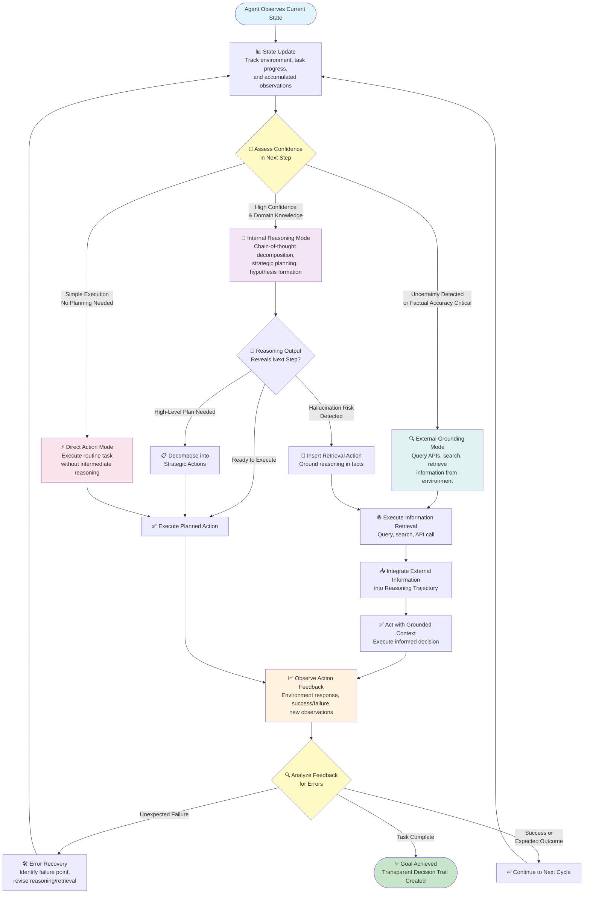

# ReAct Decision Loop: When to Reason vs. Act

```mermaid
flowchart TD
    Start([Agent Observes Current State]) --> StateUpdate["📊 State Update<br/>Track environment, task progress,<br/>and accumulated observations"]
    
    StateUpdate --> ConfidenceCheck{"🎯 Assess Confidence<br/>in Next Step"}
    
    ConfidenceCheck -->|High Confidence<br/>& Domain Knowledge| InternalReason["🧠 Internal Reasoning Mode<br/>Chain-of-thought decomposition,<br/>strategic planning, hypothesis formation"]
    
    ConfidenceCheck -->|Uncertainty Detected<br/>or Factual Accuracy Critical| ExternalGround["🔍 External Grounding Mode<br/>Query APIs, search, retrieve<br/>information from environment"]
    
    ConfidenceCheck -->|Simple Execution<br/>No Planning Needed| DirectAct["⚡ Direct Action Mode<br/>Execute routine task<br/>without intermediate reasoning"]
    
    InternalReason --> ReasoningDecision{"🤔 Reasoning Output<br/>Reveals Next Step?"}
    
    ReasoningDecision -->|High-Level Plan Needed| PlanAction["📋 Decompose into<br/>Strategic Actions"]
    
    ReasoningDecision -->|Hallucination Risk<br/>Detected| TriggerRetrieval["🔄 Insert Retrieval Action<br/>Ground reasoning in facts"]
    
    ReasoningDecision -->|Ready to Execute| ActNow["✅ Execute Planned Action"]
    
    ExternalGround --> ExecuteRetrieval["🌐 Execute Information Retrieval<br/>Query, search, API call"]
    
    ExecuteRetrieval --> IntegrateInfo["📥 Integrate External Information<br/>into Reasoning Trajectory"]
    
    IntegrateInfo --> ActWithContext["✅ Act with Grounded Context<br/>Execute informed decision"]
    
    TriggerRetrieval --> ExecuteRetrieval
    
    PlanAction --> ActNow
    
    DirectAct --> ActNow
    
    ActWithContext --> Feedback["📈 Observe Action Feedback<br/>Environment response, success/failure,<br/>new observations"]
    
    ActNow --> Feedback
    
    Feedback --> FeedbackAnalysis{"🔍 Analyze Feedback<br/>for Errors"}
    
    FeedbackAnalysis -->|Unexpected Failure| ErrorRecovery["🛠️ Error Recovery<br/>Identify failure point,<br/>revise reasoning/retrieval"]
    
    FeedbackAnalysis -->|Success or<br/>Expected Outcome| ContinueLoop["↩️ Continue to Next Cycle"]
    
    FeedbackAnalysis -->|Task Complete| End(["✨ Goal Achieved<br/>Transparent Decision Trail Created"])
    
    ErrorRecovery --> StateUpdate
    
    ContinueLoop --> StateUpdate
    
    style Start fill:#e1f5ff
    style End fill:#c8e6c9
    style ConfidenceCheck fill:#fff9c4
    style InternalReason fill:#f3e5f5
    style ExternalGround fill:#e0f2f1
    style DirectAct fill:#fce4ec
    style Feedback fill:#fff3e0
    style FeedbackAnalysis fill:#fff9c4
```
