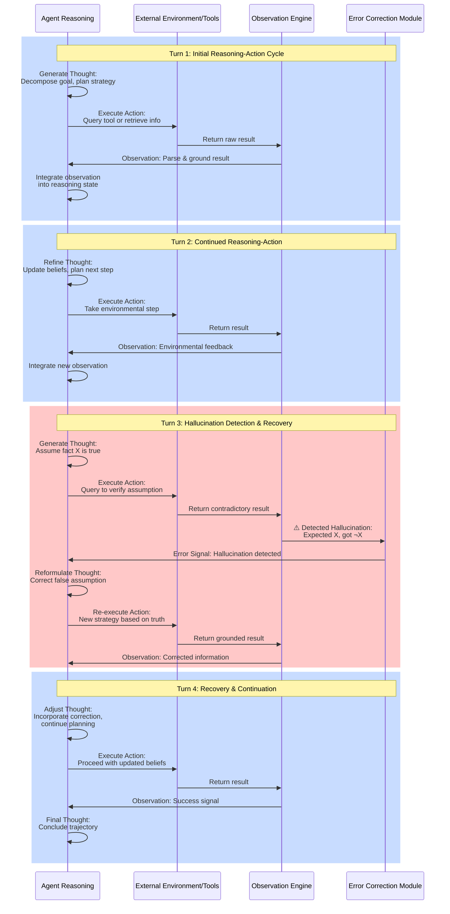

# Agent Reasoning-Action-Correction Trajectory

```mermaid
sequenceDiagram
    participant Agent as Agent Reasoning
    participant Env as External Environment/Tools
    participant Obs as Observation Engine
    participant Correct as Error Correction Module

    rect rgb(200, 220, 255)
    Note over Agent,Correct: Turn 1: Initial Reasoning-Action Cycle
    Agent->>Agent: Generate Thought:<br/>Decompose goal, plan strategy
    Agent->>Env: Execute Action:<br/>Query tool or retrieve info
    Env->>Obs: Return raw result
    Obs->>Agent: Observation: Parse & ground result
    Agent->>Agent: Integrate observation<br/>into reasoning state
    end

    rect rgb(200, 220, 255)
    Note over Agent,Correct: Turn 2: Continued Reasoning-Action
    Agent->>Agent: Refine Thought:<br/>Update beliefs, plan next step
    Agent->>Env: Execute Action:<br/>Take environmental step
    Env->>Obs: Return result
    Obs->>Agent: Observation: Environmental feedback
    Agent->>Agent: Integrate new observation
    end

    rect rgb(255, 200, 200)
    Note over Agent,Correct: Turn 3: Hallucination Detection & Recovery
    Agent->>Agent: Generate Thought:<br/>Assume fact X is true
    Agent->>Env: Execute Action:<br/>Query to verify assumption
    Env->>Obs: Return contradictory result
    Obs->>Correct: ⚠️ Detected Hallucination:<br/>Expected X, got ¬X
    Correct->>Agent: Error Signal: Hallucination detected
    Agent->>Agent: Reformulate Thought:<br/>Correct false assumption
    Agent->>Env: Re-execute Action:<br/>New strategy based on truth
    Env->>Obs: Return grounded result
    Obs->>Agent: Observation: Corrected information
    end

    rect rgb(200, 220, 255)
    Note over Agent,Correct: Turn 4: Recovery & Continuation
    Agent->>Agent: Adjust Thought:<br/>Incorporate correction,<br/>continue planning
    Agent->>Env: Execute Action:<br/>Proceed with updated beliefs
    Env->>Obs: Return result
    Obs->>Agent: Observation: Success signal
    Agent->>Agent: Final Thought:<br/>Conclude trajectory
    end
```
