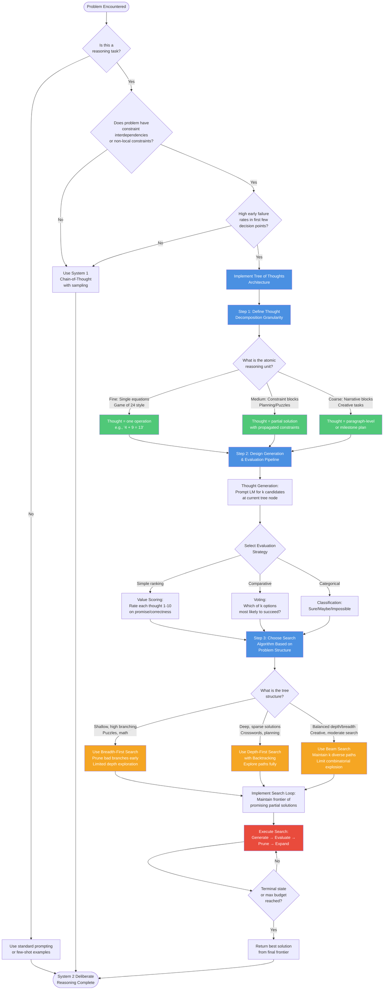

# Tree of Thoughts: Decision Framework & Architecture

```mermaid
flowchart TD
    Start([Problem Encountered]) --> Diagnose{Is this a<br/>reasoning task?}
    
    Diagnose -->|No| Simple["Use standard prompting<br/>or few-shot examples"]
    Diagnose -->|Yes| Analyze{Does problem have<br/>constraint interdependencies<br/>or non-local constraints?}
    
    Analyze -->|No| S1["Use System 1<br/>Chain-of-Thought<br/>with sampling"]
    Analyze -->|Yes| CheckFail{High early failure<br/>rates in first few<br/>decision points?}
    
    CheckFail -->|No| S1
    CheckFail -->|Yes| UseToT["Implement Tree of Thoughts<br/>Architecture"]
    
    UseToT --> Decompose["Step 1: Define Thought<br/>Decomposition Granularity"]
    Decompose --> Granular{What is the atomic<br/>reasoning unit?}
    
    Granular -->|Fine: Single equations<br/>Game of 24 style| Fine["Thought = one operation<br/>e.g., '4 + 9 = 13'"]
    Granular -->|Medium: Constraint blocks<br/>Planning/Puzzles| Medium["Thought = partial solution<br/>with propagated constraints"]
    Granular -->|Coarse: Narrative blocks<br/>Creative tasks| Coarse["Thought = paragraph-level<br/>or milestone plan"]
    
    Fine --> GenEval["Step 2: Design Generation<br/>& Evaluation Pipeline"]
    Medium --> GenEval
    Coarse --> GenEval
    
    GenEval --> Generation["Thought Generation:<br/>Prompt LM for k candidates<br/>at current tree node"]
    Generation --> EvalMode{Select Evaluation<br/>Strategy}
    
    EvalMode -->|Simple ranking| Value["Value Scoring:<br/>Rate each thought 1-10<br/>on promise/correctness"]
    EvalMode -->|Comparative| Vote["Voting:<br/>Which of k options<br/>most likely to succeed?"]
    EvalMode -->|Categorical| Class["Classification:<br/>Sure/Maybe/Impossible"]
    
    Value --> SelectSearch["Step 3: Choose Search<br/>Algorithm Based on<br/>Problem Structure"]
    Vote --> SelectSearch
    Class --> SelectSearch
    
    SelectSearch --> TreeShape{What is the tree<br/>structure?}
    
    TreeShape -->|Shallow, high branching<br/>Puzzles, math| BFS["Use Breadth-First Search<br/>Prune bad branches early<br/>Limited depth exploration"]
    TreeShape -->|Deep, sparse solutions<br/>Crosswords, planning| DFS["Use Depth-First Search<br/>with Backtracking<br/>Explore paths fully"]
    TreeShape -->|Balanced depth/breadth<br/>Creative, moderate search| Beam["Use Beam Search<br/>Maintain k diverse paths<br/>Limit combinatorial explosion"]
    
    BFS --> Implement["Implement Search Loop:<br/>Maintain frontier of<br/>promising partial solutions"]
    DFS --> Implement
    Beam --> Implement
    
    Implement --> Execute["Execute Search:<br/>Generate → Evaluate →<br/>Prune → Expand"]
    Execute --> Terminal{Terminal state<br/>or max budget<br/>reached?}
    
    Terminal -->|No| Execute
    Terminal -->|Yes| Return["Return best solution<br/>from final frontier"]
    
    Return --> End([System 2 Deliberate<br/>Reasoning Complete])
    
    S1 --> End
    Simple --> End
    
    style UseToT fill:#4a90e2,color:#fff
    style Decompose fill:#4a90e2,color:#fff
    style GenEval fill:#4a90e2,color:#fff
    style SelectSearch fill:#4a90e2,color:#fff
    style Fine fill:#50c878,color:#fff
    style Medium fill:#50c878,color:#fff
    style Coarse fill:#50c878,color:#fff
    style BFS fill:#f5a623,color:#fff
    style DFS fill:#f5a623,color:#fff
    style Beam fill:#f5a623,color:#fff
    style Execute fill:#e94b3c,color:#fff
```
